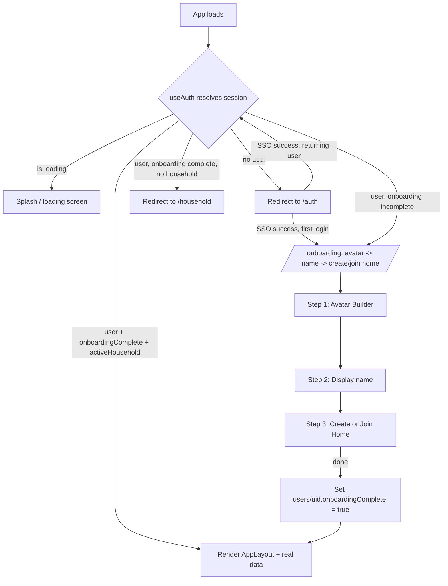

# Plan: Require SSO Login Before Showing the App (Remove Mock Fallback)

## Overview

The app currently renders the full UI (Today, Household, Profile, etc.) without ever checking whether the user is signed in. Firebase Auth (`useAuth`) and the SSO buttons exist and work, but nothing in the routing layer enforces them, and several screens quietly fall back to hardcoded mock data (`mockState.ts`) when there's no authenticated user or no active household. As a result, opening the app goes straight to the mock-populated Today screen instead of the sign-in screen.

Root causes identified in the current code:

1. **No route guard.** [routes.tsx](web/src/app/routes.tsx) mounts `AppLayout`/`TodayPage`/etc. at `/` with no check on `useAuth().user`. Visiting `/` directly (which is what happens on app load) never redirects to `/auth`.
2. **Explicit mock bypass in the UI.** [AuthPage.tsx](web/src/app/pages/AuthPage.tsx) has a "Continue with mock household" button that navigates to `/` without signing in at all.
3. **Silent mock fallback baked into data hooks.** [AppLayout.tsx](web/src/app/AppLayout.tsx) always seeds context with `initialMembers`/`initialTasks` from [mockState.ts](web/src/app/mockState.ts); [TodayPage.tsx](web/src/app/pages/TodayPage.tsx) and [useTasks.ts](web/src/features/tasks/useTasks.ts) fall back to mock tasks whenever there's no `householdId` (i.e., no auth or no household), with no visual distinction from "real" data other than a small badge on ProfilePage.
4. **No loading/auth-resolution screen.** `useAuth`'s `isLoading` state (true while Firebase resolves the session) isn't used anywhere to hold off rendering, so there's a flash of unauthenticated content on every load even once a guard is added.
5. **Local env not configured.** Only [.env.example](web/.env.example) exists, no `.env.local`. Without real Firebase config, `auth`/`db` are `null` and the app silently behaves as if signed out everywhere (this must be fixed/verified independently of the code changes below, otherwise SSO buttons will always fail).
6. **No onboarding flow after first sign-in.** [useAuth.ts](web/src/features/auth/useAuth.ts)'s `ensureUserProfile` creates a bare `users/{uid}` doc (name/email from the OAuth provider, a default avatar, empty `householdIds`) and there's no follow-up step forcing the new user to pick an avatar, set a display name, or create/join a household — they land straight on the Today screen with provider defaults and no household, which is exactly the "no household" gap described in task 5 above.

## Architecture



A single `RequireAuth` wrapper route decides between these branches; `AuthPage` no longer offers a way to reach the app without a real session. A new `/onboarding` route (also guarded by `RequireAuth`) walks a first-time user through avatar → name → create/join home as a linear wizard before they ever reach the main tab bar.

## Tech Stack

No new dependencies. Uses existing `react-router-dom` nested/guard routes, existing `useAuth`, `useAvatar`, `useHousehold` hooks. Onboarding step/progress is persisted as a new field on the existing `users/{uid}` Firestore document (no new collection).

## Data Model Addition

```
users/{uid}
  ...existing fields...
  onboardingComplete: boolean   // false/absent until the wizard finishes; written by the last onboarding step
```

## File Structure (new/modified)

```
web/src/app/
  routes.tsx                  (modified: add guard routes + /onboarding route)
  RequireAuth.tsx              (new: auth-gate wrapper component, also redirects to /onboarding when incomplete)
  pages/AuthPage.tsx           (modified: remove mock bypass button, add redirect-if-already-signed-in)
  pages/OnboardingPage.tsx     (new: 3-step wizard shell - avatar, name, create/join home)
  AppLayout.tsx                (modified: source `members` from real household data when available)
web/src/features/
  auth/useAuth.ts              (modified: ensureUserProfile sets onboardingComplete: false on first create)
  onboarding/useOnboarding.ts  (new: tracks current step, reads/writes users/{uid}.onboardingComplete + displayName)
  household/useHousehold.ts    (modified: createHousehold/joinHousehold already exist; reused as-is by step 3)
web/.env.local                 (new, developer-provided, not committed: real Firebase config)
```

## Task Breakdown

1. **Verify/document local Firebase config** — confirm `web/.env.local` exists with real `VITE_FIREBASE_*` values (copied from `.env.example` and filled in) and that Google/Microsoft providers are enabled in the Firebase console. Without this, SSO will always fail with "Firebase is not configured," making the guard in task 2 a dead end. (Not a code change; a prerequisite check.)
2. **Add a `RequireAuth` wrapper** — new component that reads `useAuth()`, and:
   - while `isLoading`, renders a lightweight splash/loading state (no flash of protected content).
   - if no `user`, redirects to `/auth` (preserving intended destination via router state, so `AuthPage` can navigate back after login).
   - otherwise renders its `children`/`<Outlet />`.
3. **Wire the guard into `routes.tsx`** — wrap the existing `AppLayout` route subtree with `RequireAuth` so `/`, `/leaderboard`, `/household`, `/profile`, `/rewards`, `/avatar`, `/tasks` all require a signed-in session. Keep `/auth` outside the guard.
4. **Remove the mock bypass from `AuthPage`** — delete the "Continue with mock household" button; after successful `signInWithPopup`, navigate to the originally-requested route (from task 2's redirect state) or `/household` if none. Also add a redirect-away-if-already-authenticated effect so a signed-in user landing on `/auth` goes straight into the app.
5. **Gate on onboarding + having an active household** — extend `RequireAuth` (or a second wrapper) so a signed-in user is routed to:
   - `/onboarding` if `users/{uid}.onboardingComplete` is falsy,
   - `/household` if onboarding is complete but there's still no `activeHousehold`,
   - the requested app route otherwise.
   This replaces silently rendering mock tasks/members with explicit, sequential states.
6. **Build the onboarding wizard (`/onboarding`, guarded)** — a 3-step linear flow reusing existing components/hooks, with a step indicator and back/next controls:
   - **Step 1 — Avatar:** reuse `AvatarBuilder` + `useAvatar` (already wired to Firestore) to let the new user pick/confirm their look before saving.
   - **Step 2 — Display name:** a simple form field seeded from the SSO `displayName`, editable, saved via `setDoc(users/{uid}, { displayName }, { merge: true })` (new capability — `useAuth`/`useAvatar` currently never let the user override the provider-supplied name).
   - **Step 3 — Create or join home:** reuse the existing create/join forms and `useHousehold().createHousehold`/`joinHousehold` (already implemented in [HouseholdPage.tsx](web/src/app/pages/HouseholdPage.tsx)), rendered inline as the final wizard step instead of navigating to the standalone `/household` page.
   On completing step 3, write `onboardingComplete: true` to `users/{uid}` and navigate into the app (`/`).
7. **Add `onboardingComplete` to the new-user profile write** — update `ensureUserProfile` in [useAuth.ts](web/src/features/auth/useAuth.ts) to set `onboardingComplete: false` (in addition to the existing default fields) when creating a brand-new `users/{uid}` doc, so `RequireAuth` has a reliable field to check from the very first login.
8. **Replace hardcoded mock members in `AppLayout`** — once a real `activeHousehold` exists, source `members` for the shared `AppMockContext` from `useHousehold().members` (already fetched) instead of `initialMembers`, mirroring the pattern already used for `tasks` in `TodayPage`/`useTasks`.
9. **Regression pass** — manually verify: (a) fresh/incognito load goes to `/auth`, not the Today screen; (b) Google and Microsoft sign-in both land in the app; (c) a brand-new user is walked through avatar → name → create/join home, in order, and cannot reach `/` before finishing; (d) a returning user with `onboardingComplete: true` and an active household skips straight to `/`; (e) sign-out returns to `/auth` on next protected navigation; (f) a signed-in user who completed onboarding but has no household (e.g. left it) is routed to `/household`, not shown mock tasks; (g) no console/network errors related to missing Firebase config.

## Risks / Open Questions

- **Mock data's future role:** `mockState.ts` still backs the Household/Task pages as a fallback for "signed in, no household yet." Confirm whether that fallback should be removed entirely (task 5 replaces it with a redirect) or kept for a specific "preview mode" — this plan assumes it should no longer be reachable from a cold app start.
- **Env/config gap:** if `web/.env.local` (task 1) isn't actually set up in the deployed environment, adding the guard will just move the failure from "shows mock" to "sign-in button errors" — worth confirming Firebase project + OAuth provider setup is genuinely complete before starting task 2 onward.
- **Redirect-back UX:** task 2/4 assume using router `state`/`Navigate` to remember the original destination; confirm this is acceptable vs. always landing on `/household` after login.
- **Onboarding step order/skippability:** this plan assumes avatar → name → home is strictly linear and non-skippable (matches "require SSO + full setup before entering the app"); confirm users shouldn't be able to skip avatar customization or defer household setup.
- **Interrupted onboarding:** if a user closes the app mid-wizard (e.g. after avatar, before creating a home), `onboardingComplete` stays `false` and `RequireAuth` will correctly resume them at `/onboarding` on next login — but the wizard needs to read back any partially-saved avatar/name so they don't restart from scratch; worth confirming step 1/2 data persists independently of step 3 completion (it does, since avatar/name are saved via existing `merge: true` writes).
- **Existing "done" checklist in [PLAN.md](PLAN.md):** tasks 5/6/8/9 are marked ✅ but this investigation shows auth/household/task wiring isn't actually enforced at the routing level, and no onboarding step exists at all — worth updating PLAN.md's status once this plan is implemented.

---

**Suggested next step:** hand this plan to an implementation agent starting with tasks 1–3 (config check + `RequireAuth` guard wired into routing), which alone fixes the reported symptom, then tasks 5–7 to add the onboarding wizard, then task 8 to remove the remaining mock fallback.
