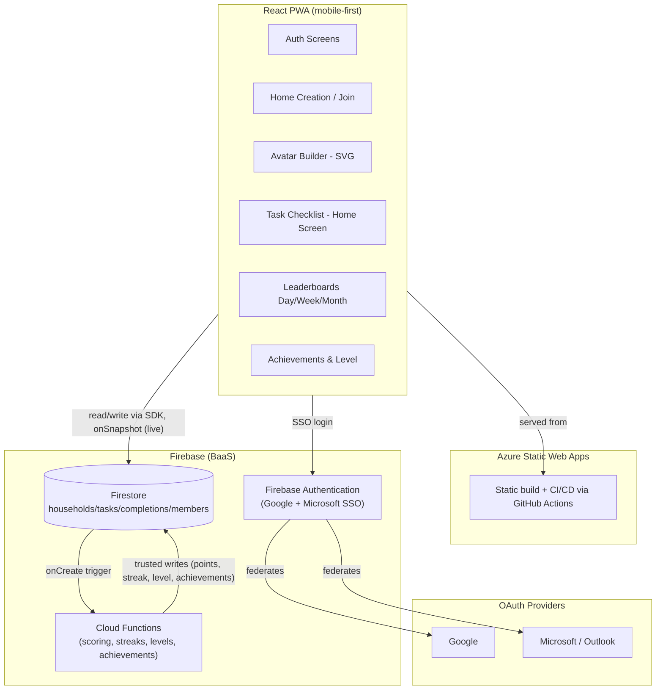

# Homie — Gamified Household To-Do App: Implementation Plan

## Overview

Homie is a mobile-first web app (PWA) where families/roommates create a shared "home", join it with a code, build a cute SVG avatar, and complete household tasks together. Completing tasks earns configurable points, feeds daily/weekly/monthly leaderboards, builds a daily streak, unlocks achievements, and levels up the user. All task completions sync live across every member's device.

Given the "deploy today, keep it simple and safe" requirement, the plan uses a BaaS (Firebase: Auth + Firestore + Cloud Functions) for data, real-time sync, and server-trusted scoring logic, with the static frontend hosted on **Azure Static Web Apps** (free tier, GitHub-connected CI/CD, HTTPS by default) — the fastest path to a live, secure deployment without managing servers. Sign-in is SSO-only via **Google** and **Microsoft (Outlook/Azure AD)** OAuth providers through Firebase Authentication — no passwords stored or handled by the app.

## Architecture



**Key principle:** clients can only write raw facts (a task was completed). All derived/trust-sensitive state (points totals, streaks, levels, achievements) is computed and written server-side by a Cloud Function, and locked from client writes via Firestore Security Rules. This prevents users from editing their own scores (OWASP: broken access control / client-side trust).

## Tech Stack

- **Frontend:** React + TypeScript + Vite
- **Styling:** Tailwind CSS, mobile-first responsive layout, bottom tab navigation
- **PWA:** `vite-plugin-pwa` (installable, manifest, app icons)
- **Realtime data:** Firebase Firestore `onSnapshot` listeners
- **Auth:** Firebase Authentication, SSO-only via **Google** provider and **Microsoft** provider (`microsoft.com` OAuth, covers Outlook/Hotmail/Microsoft 365 accounts) — no email/password sign-up
- **Server logic:** Firebase Cloud Functions (TypeScript, Firestore triggers)
- **Hosting:** Azure Static Web Apps (free tier) with GitHub Actions CI/CD
- **Avatar rendering:** Hand-built layered SVG React components (no image uploads/storage needed)

## Data Model (Firestore)

```
users/{uid}
  displayName, email, avatarConfig, householdIds[], activeHouseholdId

households/{householdId}
  name, joinCode, createdBy, createdAt, defaultPointsPerTask

households/{householdId}/members/{uid}
  displayName, avatarConfig, joinedAt
  totals: { lifetimePoints, dailyPoints, weeklyPoints, monthlyPoints }  // Cloud Function-writes only
  streak: { current, longest, lastCompletedDate }                       // Cloud Function-writes only
  level: { level, xp, xpToNextLevel }                                   // Cloud Function-writes only

households/{householdId}/tasks/{taskId}
  title, points, recurrence (daily|weekly|once), assignedTo, active, createdBy

households/{householdId}/taskCompletions/{completionId}
  taskId, userId, completedAt, dateKey (yyyy-mm-dd), pointsAwarded, weekKey, monthKey

households/{householdId}/achievements/{achievementId}      // static catalog, seeded once
  key, title, description, icon, criteria

households/{householdId}/members/{uid}/unlockedAchievements/{achievementId}
  unlockedAt
```

## File Structure

```
homie/
  .github/workflows/azure-static-web-apps.yml
  design/
    stitch-export/        // raw unzip of the Stitch export: HTML/CSS, design.md, images
    stitch-prompt.md       // the prompt used to generate the Stitch UI design
  firebase/
    firestore.rules
    firestore.indexes.json
    functions/
      src/
        index.ts
        onTaskCompletionCreated.ts   // scoring, streak, level, achievement logic
        leveling.ts                  // XP thresholds
        achievements.ts              // achievement definitions + checks
  web/
    index.html
    vite.config.ts
    tailwind.config.ts
    src/
      main.tsx
      app/
        App.tsx
        routes.tsx
      firebase/
        firebaseClient.ts
      features/
        auth/            (LoginForm, SignupForm, useAuth)
        household/        (CreateHouseholdForm, JoinHouseholdForm, useHousehold)
        avatar/            (AvatarBuilder, avatarParts/*.tsx, AvatarPreview)
        tasks/             (TaskList, TaskCard, CreateTaskForm, useTasks, useTaskCompletions)
        leaderboard/       (LeaderboardTabs, useLeaderboard)
        gamification/      (LevelBadge, StreakBadge, AchievementsGallery)
      components/          (shared UI: BottomNav, Button, Modal, etc.)
      types/
        models.ts
    public/
      manifest.webmanifest
      icons/
  PLAN.md
```

## Task Breakdown

0. **Import UI design** — generate the mobile UI in Stitch using `design/stitch-prompt.md`, export the project, and unzip it into `design/stitch-export/` (HTML/CSS, design.md, images). This becomes the visual/design-system reference for task 1 onward — colors, typography, spacing, and component shapes are pulled from here into the Tailwind config, rather than the raw HTML being reused directly.
1. ✅ **Scaffold the frontend project** — Vite + React + TypeScript app under `web/`, Tailwind CSS setup seeded from `design/stitch-export/`, ESLint/Prettier, base folder structure, mobile-first shell (bottom nav + routes placeholders).
2. ✅ **Create Firebase project** — enable Authentication (email/password), Firestore, Cloud Functions (Blaze plan required for functions); add `firebaseClient.ts` config using env vars (never commit secrets).
3. ✅ **Set up Azure Static Web Apps** — link GitHub repo, let Azure generate the GitHub Actions workflow, point build to `web/`, verify a "hello world" deploy goes live (fastest path to "deployed today").
4. ✅ **Implement the frontend UI (single task)** — build every screen from `design/stitch-export/` as React + TypeScript + Tailwind components, wired only to local/mock state (no Firebase calls yet): Sign In, Create/Join Home, Avatar Builder, Home/Task Checklist, Create/Edit Task dialog, Manage Tasks, Leaderboard, Level & Achievements, plus shared components (BottomNav, Button, Modal) and routing between them. Goal: a fully clickable, navigable prototype with realistic fake data, matching the design system, before any backend wiring begins.
5. ✅ **Wire up auth** — replace the mock sign-in screen with real Firebase Auth `GoogleAuthProvider` (Microsoft SSO deferred); on first login, create the `users/{uid}` profile doc from the provider's name/email/photo.
6. ✅ **Wire up household create/join** — connect the Create/Join Home screen to real logic: create household with generated join code; join existing household by code; store membership in `users.householdIds` and `households/{id}/members/{uid}`.
7. ✅ **Wire up the avatar builder** — connect the picker UI to `avatarConfig` state; save chosen config to the user/member docs; render the resulting SVG avatar (built as layered components) wherever a user is shown.
8. ✅ **Wire up task management** — connect the Create/Edit Task dialog and Manage Tasks screen to real Firestore reads/writes: CRUD for household tasks (title, configurable points, recurrence: daily/weekly/once, optional assignee), scoped to the household.
9. ✅ **Wire up the Home checklist with live sync** — replace mock task data with real `onSnapshot` listeners; checking a task writes a `taskCompletions` doc (client writes facts only), and all members' views update live.
10. ✅ **Cloud Function: scoring engine** — Firestore trigger on `taskCompletions` create: award `pointsAwarded`, update member's daily/weekly/monthly/lifetime totals, recompute streak (increment if consecutive day, reset if gap), idempotent via a `processed` flag and validated (task exists/active, no double completion for once tasks). Day boundary = the member-provided `dateKey`.
11. ✅ **Wire up leaderboards** — connect the Leaderboard screen to day/week/month queries/aggregations of member totals per household, live via `onSnapshot`.
12. **Leveling system** — XP thresholds (e.g., increasing curve) in `leveling.ts`; Cloud Function updates `level` on each completion; connect the Level & Achievements screen's level badge/progress bar to real data.
13. **Achievements system** — seed achievement catalog; Cloud Function checks criteria after each completion (e.g., first task, 7-day streak, 50 tasks, weekly #1) and writes unlocks; connect the achievements gallery + unlock toast/notification to real data.
14. **Security hardening pass** — write and test Firestore Security Rules: users can only read/write within their own household(s); only Cloud Functions (Admin SDK) can write `totals`, `streak`, `level`, `unlockedAchievements`; validate task/completion writes (schema, ownership, no duplicate completions); enable Firebase App Check to block unauthorized clients.
15. **PWA & mobile polish** — manifest + icons, offline app shell caching (data still requires network for live sync), final responsive pass on all screens, install prompt.
16. **Final deploy & smoke test** — push to `main`, confirm Azure Static Web Apps CI/CD deploy succeeds, verify Firebase security rules in production, test multi-user live sync end-to-end on mobile viewport.

## Risks / Open Questions

- **Two-cloud setup:** Firebase (data/auth/functions) + Azure (hosting) is the fastest path to a same-day, secure deploy, but is two providers to manage. Alternative (all-Azure: Static Web Apps + Functions + Cosmos DB) is more unified but slower to stand up today given Cosmos DB change-feed + custom auth work.
- **Cloud Functions billing:** requires Firebase's pay-as-you-go (Blaze) plan; usage should stay within/near free-tier limits for a household-scale app, but confirm this is acceptable.
- **Timezone/day boundaries:** streaks and daily points depend on a definition of "day" per household (server UTC vs. member local time) — needs a decision before task 10.
- **Recurrence logic for tasks:** how "daily" tasks reset (new checklist entry each day) vs. "once" tasks (single completion) needs a small spec before tasks 8–9.
- **Anti-cheat surface:** relies entirely on Firestore rules + Cloud Functions correctness; task 14 must include rule tests before considering the app "safe."
- **Avatar scope:** plan assumes a small fixed set of SVG parts (not full editor/animation) to stay achievable today; confirm this matches the "cute" bar expected.
- **Microsoft SSO setup step:** unlike Google (zero-config in Firebase), the Microsoft provider needs a one-time Azure AD app registration (client ID + secret, redirect URI pointed at Firebase's auth handler) before it can be enabled in Firebase — a small extra setup step in task 5, not just a config toggle.
- **SSO-only implication:** since there's no email/password fallback, if a user's Google or Microsoft account is unavailable/blocked, they have no alternate way to sign in — acceptable trade-off for simplicity/security, but worth confirming.
- **Prototype-then-wire approach:** task 4 builds the whole UI against mock data before any screen is wired to Firebase (tasks 5–13). This front-loads visual/UX feedback but means some rework is expected when real data shapes (e.g., loading/empty/error states) don't perfectly match the mock data used in task 4.

---

**Suggested next step:** tasks 1 and 2 are done. Hand this plan to an implementation agent starting with task 3 (Azure Static Web Apps deploy) and task 4 (build the full frontend UI against mock data) to get a live, clickable prototype today, then proceed sequentially through the wiring tasks (5–13) and beyond.
